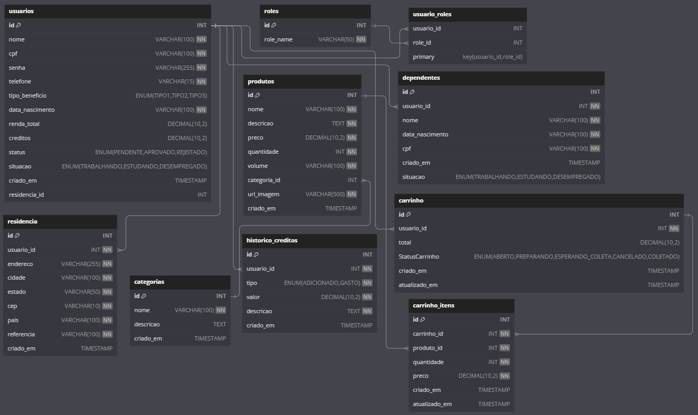

<h1>Cesta Solidária</h1>

E um projeto de extensão desenvolvido em colaboração com uma igreja, com o objetivo de promover a inclusão social por meio da distribuição de cestas básicas para famílias em situação de vulnerabilidade. O projeto integra conhecimentos de <strong>Programação Orientada a Objetos em Java</strong>, <strong>Computação em Nuvem</strong>, e <strong>Banco de Dados</strong>.

<h2>Funcionalidades</h2>
<ol>
    <li><strong>Cadastro e Login</strong>
        <ul>
            <li>Usuários podem se registrar e realizar login para acessar a plataforma.</li>
        </ul>
    </li>
    <li><strong>Usuário</strong>
        <ul>
            <li>CRUD de Usuário: Gerenciamento completo dos dados do usuário.</li>
            <li>CRUD de Residência: Cadastro e atualização dos dados de residência.</li>
            <li>CRUD de Dependentes: Gerenciamento dos dependentes dos usuários.</li>
            <li>A quantidade de créditos é determinada com base na renda per capita.</li>
        </ul>
    </li>
    <li><strong>Administrador</strong>
        <ul>
            <li>CRUD de Produto: Gerenciamento de produtos disponíveis para compra.</li>
            <li>Atualização de Estoque: Controle do estoque de produtos.</li>
            <li>Histórico de Créditos: Registro de movimentações de créditos dos usuários.</li>
            <li>Aprovação de Usuário: Controle de aprovação dos usuários para acesso ao sistema.</li>
            <li>Sistema de Créditos: Créditos são concedidos aos usuários no dia 1º de cada mês.</li>
        </ul>
    </li>
    <li><strong>Dados Públicos</strong>
        <ul>
            <li>Visualização de todos os produtos disponíveis, com detalhes de preço e quantidade em estoque.</li>
            <li>QRCode para Doações: Geração de QR Code para doações à igreja via PIX.</li>
        </ul>
    </li>
</ol>

<h2>Instalação</h2>

Para instalar o projeto Cesta Solidária, siga os passos abaixo:

<ol>
    <li><strong>Clone o repositório</strong>
        <ul>
            <li>Abra o terminal e execute o seguinte comando:</li>
            <code>git clone https://github.com/0t4v14n0/CestaSolidaria.git</code>
        </ul>
    </li>
    <li><strong>Crie o database no MySQL</strong>
        <ul>
            <li>Crie o database com esse comando:</li>
            <code>create database cestaSolidaria;</code>
        </ul>
    </li>
    <li><strong>Rode o projeto na sua IDE para a criação das tabelas</strong>
        <ul>
            <li>Certifique-se de ter o JDK (Java Development Kit) instalado.</li>
            <li>Use uma IDE como IntelliJ IDEA ou Eclipse para rodar o projeto.</li>
        </ul>
    </li>
    <li><strong>Inicie a tabela de roles</strong>
        <ul>
            <li>Execute o comando abaixo:</li>
            <code>INSERT INTO roles (role_name) VALUES ('USER'), ('ADMIN');</code>
        </ul>
    </li>
    <li><strong>Agora é só aproveitar</strong>
        <ul>
            <li>Por fim, execute o projeto novamente.</li>
        </ul>
    </li>
</ol>

<h2>Diagrama do Banco de Dados</h2>
